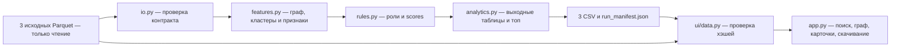

# ApexFlow

ApexFlow — локальное рабочее место AML-аналитика банка. Оно превращает выгрузку переводов в объяснимую очередь проверки: клиент → связи → гипотеза роли → ограничения → следующий шаг специалиста. Графовый baseline работает без API-ключей, платных сервисов и GPU.

Роль и score не устанавливают виновность. `role_score` отражает поддержку гипотезы правилами, `priority_score` помогает упорядочить проверку; ни один из них не является вероятностью преступления.

## Как работает решение

Аналитик помещает три исходных Parquet в `data/` и запускает Compose. Pipeline сверяет схемы и агрегаты, строит направленный граф, рассчитывает признаки, роли, кластеры и топ-20, сохраняет CSV и manifest. Интерфейс открывается после успешного расчёта. Пользователь выбирает клиента из очереди или ищет любой gid, изучает направление переводов, объяснение роли и кластер, проверяет ограничения и следующий шаг, затем скачивает результаты для ручной проверки.

## Технологии и архитектура

| Компонент | Реализация |
|---|---|
| Аналитика и ввод/вывод | Python 3.12, pandas 2.2.3, PyArrow 18.1.0, NetworkX 3.4.2 |
| Основной интерфейс | Streamlit 1.41.1, локальный SVG без CDN |
| Запуск и проверки | Docker, Docker Compose, pytest 8.3.4, Streamlit AppTest; GitHub Actions |
| Дополнительное статическое демо | HTML/CSS/JavaScript, синтетический JSON; тесты Node.js 22 |
| AI-модели, API и внешние сервисы | В runtime не используются: роли определяются открытыми правилами; AI-агент применялся при разработке |

Прямые версии закреплены в `requirements.txt` и `requirements-dev.txt`, транзитивные — в `requirements-lock.txt`; Dockerfile фиксирует Python-образ по digest. Manifest сохраняет фактически установленные версии, revision и хэш исходного кода. Сборка скачивает образ и пакеты; готовый анализ работает без внешней сети.



`pipeline.py` управляет всей цепочкой расчёта; `analyze()` не изменяет входные таблицы и не работает с сетью или файлами. Compose использует общий образ для pipeline и UI, отдельную цель сборки для тестов. Подробная [схема решения](docs/architecture.md) и [соответствие требованиям](docs/requirements-audit.md).

## Запуск в Docker

Нужны Docker с Compose, Git/копия проекта и браузер. Python на хосте не требуется. Из корня проекта:

```bash
mkdir -p data output
```

Поместите предоставленные организаторами `nodes.parquet`, `edges.parquet`, `transactions.parquet` в `data/`. Данные не распространяются вместе с образом и не загружаются автоматически.

**На Linux до первого запуска** задайте непривилегированного пользователя, которому принадлежат каталоги данных и результатов:

```bash
export APEXFLOW_UID=$(id -u)
export APEXFLOW_GID=$(id -g)
```

Запускайте эти команды от обычного пользователя. Docker Desktop использует собственную модель доступа к папкам; там обычно подходят значения по умолчанию UID/GID 10001. `output/` должен разрешать запись пользователю контейнера, а исходники — чтение. Не открывайте запись всем пользователям.

Для сохранения версии кода в manifest можно выполнить `export APEXFLOW_REVISION=$(git rev-parse HEAD)`; без этого версия обозначена `unknown`. После подготовки **одна команда запускает весь продукт**:

```bash
docker compose up --build --force-recreate
```

Compose выполняет проверку входов, аналитику и запись результатов, затем запускает Streamlit: [http://localhost:8501](http://localhost:8501). В `output/` остаются три CSV и служебные `run_manifest.json`, `run_status.json`, `data_profile.json`: состояние расчёта, SHA256, версии, время и агрегированный профиль. Это метаданные, а не дополнительные обязательные CSV. Остановка:

```bash
docker compose down
```

`data/` подключается только для чтения; `output/` — с записью у pipeline и чтением у UI. Контейнеры по умолчанию работают без root.

Для другого расположения файлов задайте `APEXFLOW_DATA_DIR` и `APEXFLOW_OUTPUT_DIR`; значения по умолчанию — `./data` и `./output`. Эти каталоги должны быть раздельными и не вложенными. Порт меняется через `APEXFLOW_PORT` (по умолчанию 8501). Повторный расчёт обновляет сгенерированные CSV и метаданные в выбранном output. Чтобы сохранить прошлый расчёт, создайте другую папку и задайте её через `APEXFLOW_OUTPUT_DIR` перед запуском.

Перед пересчётом остановите UI и повторите основной запуск. Отдельный расчёт без интерфейса:

```bash
docker compose run --rm --build pipeline
```

Время в JSON-отчёте pipeline относится к расчёту; первоначальная сборка/скачивание образа измеряется отдельно. Актуальные выполненные проверки и ограничения — в [протоколе приёмки](docs/acceptance.md).

Приёмка именно предоставленного полного набора и проверка результата без пересчёта:

```bash
docker compose run --rm --build pipeline python -m apexflow --acceptance --json
docker compose run --rm --no-deps pipeline python -m apexflow --verify-output
```

`--acceptance` проверяет ожидаемые размеры/seed, июль 2026 и ограничение времени; synthetic-набор не пройдёт этот режим. `--verify-output` сверяет статус, хэши файлов и код текущего образа; старые результаты без новых метаданных нужно пересчитать. Если после аварии остался `.pipeline.lock`, сначала убедитесь, что ни один процесс не пишет в этот output; только затем удалите этот конкретный lock и повторите запуск. Подробности и PowerShell-команды — в [передаче разработчика 1](docs/pipeline-handoff.md).

## Возможности интерфейса

- Поиск любого полного `gid`, включая большой int64, клиента вне топа, изолят и depth=4.
- Глобальный топ с фильтрами роли/кластера. Ранги сохраняются, поиск всегда проверяет полный набор.
- Направленный граф соседей или кластера со стрелками `src → dst`, окраской по ролям/кластерам, легендой, отметками seed и выбранного клиента. В окружении выбранный клиент расположен в центре. Метки `№` — локальные номера, полный gid доступен при наведении. Число скрытых по лимитам узлов/рёбер подписано, все связи клиента доступны в таблицах.
- Карточка с ролью, evidence, scores, depth, seed, суммами и внешними контрагентами. Самопереводы включены в суммы, но не в число внешних контрагентов.
- Карточка кластера выбранного клиента: размер, seed, внутренний оборот, гипотеза; переход из `top_gids` к клиенту.
- Оговорки неполноты и следующий шаг для каждой роли, отдельно для boundary, seed и изолята.
- Три полных CSV текущего расчёта; фильтры не сокращают выгрузку. Период берётся из фактических дат `transactions`.

UI проверяет контракт и SHA256 всех трёх Parquet и CSV по завершённому manifest. Неуспешный/незавершённый расчёт, изменённые исходники или CSV блокируют реальные результаты, включая ранее кэшированные. При каждом действии пользователя проверка повторяется; неподвижная открытая страница сама диск не опрашивает. Синтетический режим включается только вручную.

## Входы и результаты

По ТЗ (§5–6) вход — **три Parquet**, CSV — результат анализа. Существующие CSV в корне проекта не используются как исходники и штатным запуском не перезаписываются. Исходные Parquet не редактируются; SHA256 до и после расчёта проверяется. CSV и Parquet не включаются в Git и Docker-образ, результаты передаются жюри через разрешённый канал сдачи.

| Файл | Поля |
|---|---|
| `data/nodes.parquet` | `gid, depth, is_seed` |
| `data/edges.parquet` | `src, dst, sum_kzt, n_tx, depth` |
| `data/transactions.parquet` | `src, dst, date, sum_kzt` |
| `output/nodes_roles.csv` | `gid, role, role_score, cluster_id, priority_score, evidence` |
| `output/clusters.csv` | `cluster_id, n_nodes, n_seed, sum_kzt_internal, top_gids, hypothesis` |
| `output/top_nodes.csv` | `rank, gid, role, priority_score, why` |

CSV — UTF-8 без индекса pandas; `top_gids` — JSON-массив целых. Все узлы, включая изоляты, сохраняются. Подробности: [общий контракт](docs/team/00-contracts.md), [методология ролей и scores](docs/methodology.md), [профиль данных](docs/data_profile.md), [схема](docs/architecture.md).

Предоставленная выгрузка: 2 248 узлов, 3 119 направленных рёбер, 4 840 транзакций за 01–31 июля 2026 года, 81 seed и 19 изолятов. Это один период переводов внутри банка от 5 000 KZT, обход исходящих до depth=4. Выгрузка обезличена; атрибутов клиента и разметки истинных ролей нет. Внешнего обогащения и подключения к банковским системам в прототипе нет. `transactions` используется для сверки количества и сумм операций с `edges` и определения периода; временная модель ролей пока не реализована.

## Правила ролей и пороги

Правила используют рассчитанные признаки, без списков заранее выбранных gid. Число плательщиков/получателей для денежных ролей учитывает только внешних контрагентов с положительной суммой. `Q75`, `Q90`, `Q95` — квантили положительных значений по текущему набору, с линейной интерполяцией.

| Порог | Формула | На предоставленном наборе |
|---|---|---:|
| Много плательщиков | `max(3, Q75(funded_in_degree))` | 3 |
| Много получателей | `max(5, Q75(funded_out_degree))` | 5 |
| Существенный внешний вход | `max(1 KZT, Q75(external_in_sum))` | 166 819,7 KZT |
| Высокая центральность | `Q90(betweenness)`; если положительных значений нет, coordinator отключён | ≈0,00038929534 |

При пересечении условий применяется первое подходящее правило в порядке таблицы:

| Роль | Условие |
|---|---|
| `coordinator` | Высокая центральность, достижимость минимум из 2 seed, связи минимум с 2 другими кластерами |
| `distributor` | Много получателей и положительный внешний исходящий оборот |
| `consolidator` | Много плательщиков и существенный внешний входящий оборот |
| `terminal` | Существенный вход, исходящий/входящий ≤0,1; запрещён для seed, depth=4 и узлов с самопереводами |
| `transit` | Положительные внешние вход/выход, отношение исходящего к входящему 0,8–1,2; те же исключения |
| `peripheral` | Остальные узлы, в том числе изоляты |

`role_score` — взвешенная поддержка роли признаками, нормированными через Q95 и ограниченными [0,1]; для peripheral — 0. Все формулы и веса приведены в [методологии](docs/methodology.md#роли). Это сила эвристики, не обученная вероятность.

Очередь едина для всех ролей: `priority_score = 0.35*norm(log1p(in_sum+out_sum)) + 0.25*norm(число уникальных соседей) + 0.25*norm(betweenness) + 0.15*norm(число достижимых seed-источников)`. Здесь `norm` — min–max по запуску, одинаковым значениям соответствует 0. Равные scores упорядочены по gid. `why` объясняет до трёх крупнейших взвешенных вкладов; evidence роли содержит фактические признаки и ограничения, до 200 символов.

Для центральности используется ненагруженный направленный граф: точный расчёт до 500 узлов, иначе 128 воспроизводимых источников (`seed=42`). Сумма перевода не считается длиной пути. Кластеры — Louvain на неориентированной взвешенной проекции без петель и нулевых денежных рёбер (`seed=42`); все узлы сохраняются. На выданном наборе получаются 88 кластеров, 2 248 строк ролей и топ-20. Номер кластера не является постоянным идентификатором группы при изменении данных.

## Проверки и демо

Тесты в контейнере выполняются без внешней сети, на синтетических файлах, без монтирования банковских данных:

```bash
docker compose --profile test run --rm --build tests
```

Они проверяют аналитику, контракты, pipeline, свежесть результатов, CSV/Parquet, большие int64, изоляты, направления рёбер и Streamlit AppTest. Сквозной запуск на реальных данных и просмотр браузера проверяются отдельно.

Расширенная синтетическая проверка сборки, тестов, CLI, UI, прав томов, повторяемости, сохранения после остановки и блокировки UI при неверном входе: `bash tests/compose_smoke.sh` (Bash либо Git Bash с Docker Desktop). Она использует отдельные `.ci/smoke.*`, Compose-проект и порт 18501, не перезаписывая реальные data/output. Свои контейнеры скрипт останавливает автоматически.

После реального расчёта получите актуальные примеры для защиты:

```bash
docker compose run --rm --no-deps ui python -m ui.demo_examples
```

Команда печатает период, отчёт pipeline и до трёх примеров: приоритетный non-seed, другой профиль потоков и boundary либо изолят. Для каждого — gid, evidence, суммы, контрагенты и ребро для сверки. Примеры выбираются из текущих файлов, отсутствующий профиль не придумывается. Найдите gid в UI, сравните карточки с CSV и стрелки с edges, проверьте поиск при включённом фильтре и скачивание полных CSV. Далее — [сценарий пяти минут](docs/demo.md).

Сценарий, который может повторить жюри:

1. Выполнить основной запуск с предоставленными Parquet. Дождаться UI; сверить 2 248 узлов, 3 119 рёбер и июльский период. Отсутствующий или некорректный вход должен завершить pipeline с ошибкой, а не показать реальные результаты.
2. Получить примеры командой выше. Вставить первый полный gid в поиск, сопоставить evidence и scores с `nodes_roles.csv`, направления и суммы — с таблицами связей. Переключить окраску ролей/кластеров.
3. Найти boundary/изолят из примеров. Проверить предупреждение о границе или отсутствии связей; для seed — неполноту входящих извне графа за тот же период. Фильтр топа не должен мешать поиску.
4. Скачать все три CSV: роли — для 2 248 узлов, кластеры — 88 строк, топ — 20 строк. Фильтры интерфейса не меняют размер выгрузок.
5. Запустить тесты выше. Для проверки полного повторного расчёта, перестановки строк, всех gid и SHA256 выполнить `docker compose run --rm pipeline python -m scripts.verify_dataset`. Эта проверка создаёт результаты в выбранном output; для сохранения прежних CSV заранее выбрать другую папку.

Проверенный полный расчёт в собранном контейнере занимает менее секунды на текущем наборе; это не включает скачивание, сборку и старт контейнера. Точные результаты, окружение и отдельный статус CI — в [приёмке](docs/acceptance.md).

## Синтетическая демонстрация

Для UI без данных и пересчёта:

```bash
docker compose run --rm --build --no-deps --service-ports ui
```

Откройте localhost:8501 и вручную включите «Синтетический пример». В нём 7 узлов, 6 рёбер и 2 кластера; роли/scores заданы для проверки UI, период не задан. Он не подменяет реальные результаты при ошибке.

Статическая версия [site/](site/) использует тот же явно синтетический `site/demo-data.json`, без Python и банковских файлов. Workflow [deploy-pages.yml](.github/workflows/deploy-pages.yml) публикует только `site/` из `main`. Владелец репозитория должен выбрать Settings → Pages → GitHub Actions; наличие workflow само по себе не доказывает публикацию. Проверка логики сайта в Node 22 без установки Node на хост:

```bash
docker pull node:22-alpine
docker run --rm --network none -v "$PWD:/work:ro" -w /work node:22-alpine node --test tests/test_site.mjs
```

Основной продукт и приёмка работают через Compose.

## Развёрнутая версия

Проверенный адрес основного продукта — [http://localhost:8501](http://localhost:8501) после запуска Docker на компьютере пользователя. Подтверждённой публичной ссылки на развёрнутый продукт нет. Статический сайт — дополнительная синтетическая демонстрация; наличие конфигурации GitHub Pages не означает успешный deployment. Текущее внешнее ограничение GitHub Actions описано в [приёмке](docs/acceptance.md#ci-и-выпуск).

## Ограничения и участие команды

`depth=4` не доказывает конечное получение денег; входящие seed от узлов вне графа могут быть неполными за наблюдаемый период. Положение в графе не доказывает управление, похожие суммы — перевод одних и тех же средств. Без разметки проект не заявляет accuracy/precision или экономический эффект. Временные признаки, промышленный доступ/аудит действий, проверка других периодов и масштабирование — дальнейшая работа. Денежные аналитические признаки хранятся в float64: на экстремально больших суммах возможна потеря малых единиц; для бухгалтерской точности потребуется фиксированная десятичная арифметика. Целочисленные исходные суммы между edges и transactions сверяются точно.

Граф использует локальный SVG без CDN. Первой сборке образа нужна сеть, собранный pipeline и визуализация не требуют внешних сервисов. Изменения идут из личных веток в `staging`; выпуск — PR `staging` → `main` после проверок. Защита веток зависит от настроек владельца репозитория, Git-процесс не подменяет её.

AI-агент помогает разработке и проверкам, но не заменяет личный вклад и понимание решений участниками. Независимое прохождение README, репетиция и подтверждённая отправка на платформе требуют действий команды.

## Масштабирование до примерно 1 млн узлов

Это план изменения подхода, а не заявленная производительность текущей версии. При миллионе узлов pandas и Python-объекты NetworkX потребуют существенно больше памяти; обходы от каждого seed стоят порядка `S*(V+E)`, выборочная центральность — `128*(V+E)`. Число рёбер и seed так же важно, как число узлов.

- Читать только нужные колонки Parquet, агрегировать транзакции пакетами, хранить денежные суммы в целых минимальных единицах/decimal с проверкой переполнения, gid — точно в int64.
- Перейти от Python-объектов к компактным массивам/CSR и специализированной CPU-реализации графовых алгоритмов; сначала измерить память и время на репрезентативном наборе. GPU и облако не должны стать обязательными для малого baseline.
- Считать достижимость по компонентам, использовать пакетные обходы/битовые наборы seed; центральность оценивать ограниченной выборкой с фиксированным seed, измерять устойчивость ролей и топа к числу источников.
- Считать сообщества и признаки фоновыми пакетными заданиями с контрольными точками и версией данных. Пороговые квантили, формулы и выбранное приближение сохранять рядом с результатом.
- В UI загружать проиндексированную карточку и ограниченное окружение выбранного gid, выдавать таблицы страницами; не передавать миллион узлов в браузер. Подписывать ограничения подграфа и сохранять доступ к полной выгрузке.
- Перед переходом сравнить результаты с точным расчётом на малых графах, провести нагрузочный тест CPU/RAM/времени и определить допустимые пределы ошибок приближений. Измерение на текущих 2 248 узлах не доказывает работу на миллионе.
