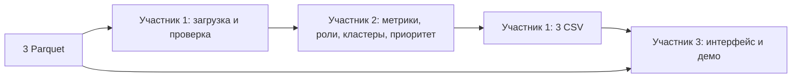
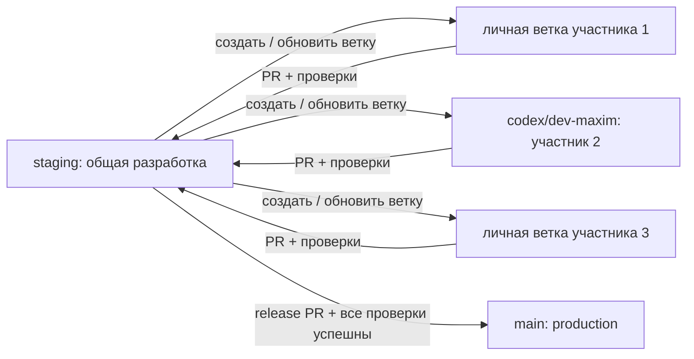

# ApexFlow: план работы команды из трёх человек

План на 5 часов по двум PDF в корне проекта: ТЗ «Граф денег» (русская версия, страницы 2–9) и «Инструкция для участников HackAlem AI» (страницы 1–2). Это план реализации, а не описание уже готовых функций. Максим — разработчик 2. Имена разработчиков 1 и 3 пока не указаны.

## Подробные инструкции: что читать каждому

Сначала все читают [общий договор](docs/team/00-contracts.md), затем свою инструкцию. Там указаны файлы, предлагаемые функции, последовательность действий, проверки, точки передачи работы и готовые задания для Codex.

| Документ | Кому нужен | Содержание |
|---|---|---|
| [Общий договор](docs/team/00-contracts.md) | Всем | Владельцы файлов, входы/выходы, схемы CSV, сигнатура analyze, правила интеграции |
| [Разработчик 1: данные и пайплайн](docs/team/01-data-pipeline.md) | Другому участнику | Валидация Parquet, CLI, запись/проверка CSV, CI, интеграция, выпуск |
| [Разработчик 2: Максим, аналитика](docs/team/02-maxim-analytics.md) | Максиму | Граф, признаки, правила ролей, scores, кластеры, объяснения, тесты и методология |
| [Разработчик 3: интерфейс и демо](docs/team/03-ui-demo.md) | Третьему участнику | Экраны, поиск любого gid, граф, карточки, README, схема, защита и сдача |
| [Банковский сценарий и жюри](docs/team/04-bank-and-jury.md) | Всем | Ценность для AML-аналитика, доказательства по критериям, приоритет улучшений |
| [Рабочая карта и приёмка](docs/team/05-execution-and-acceptance.md) | Всем | Задачи A/M/U, зависимости, контрольные точки, 14 проверок, ответы жюри и правила участия |

Обязательные требования ТЗ отделены от предлагаемых решений команды. Конкретные формулы и пороги в инструкции Максима — стартовые гипотезы для проверки, не установленные результаты анализа датасета. Подробная инструкция развивает краткое описание ниже; при изменении внешнего контракта сначала обновляется общий договор.

Дополнительно прочитан «Правила зачета участия.pdf»: каждый участник вносит личный вклад, проект создаётся в рамках хакатона, весь последний час участники находятся на площадке. Практические ограничения учтены в рабочей карте. Копия инструкции с суффиксом `(1)` совпадает с исходной инструкцией.

## Что требуется сдать

**Контекст: проект для банка; цель команды — призовое место на хакатоне.** Приоритет — рабочее место AML-аналитика с проверяемыми объяснениями, корректной обработкой неполноты данных и воспроизводимым Docker-запуском. Подробная стратегия по критериям жюри и дополнительным задачам каждого участника: [банковский сценарий и защита](docs/team/04-bank-and-jury.md). Цель усиливает качество обязательного решения, а не отменяет пятичасовой лимит.

Локальный аналитический инструмент: три Parquet → граф и метрики → объяснимые роли и кластеры → три CSV и интерактивный экран. Главный вопрос: «Кого проверять первым и почему?»

По ТЗ: 2 248 узлов, 3 119 рёбер, 4 840 транзакций, 81 seed, июль 2026. Эти числа взяты из документа; фактические данные нужно проверить при загрузке.

- Один воспроизводимый запуск от исходных данных до всех трёх выгрузок, целевое время строго менее 5 минут: в ТЗ встречаются как `< 5`, так и `≤ 5` минут.
- Роль, score, cluster_id и непустое объяснение у каждого узла, включая изолированные.
- Формальные критерии и пороги для шести ролей: `consolidator`, `transit`, `distributor`, `terminal`, `coordinator`, `peripheral`.
- Кластеры с численностью, количеством seed, внутренним оборотом и гипотезой о назначении.
- Топ не менее 20 узлов с объяснениями; граф со стрелками, ролями, кластерами и поиском по любому gid.
- Код, три итоговых CSV, README на русском, одна схема решения, 5-минутное демо с живым запуском и разбором 2–3 узлов.
- Использовать AI-агента при разработке; обязательного LLM внутри продукта нет. Отправить итоговый код в выданный репозиторий и отдельно сдать решение на платформе.

Оценивание: работоспособность — 25; техническая реализация — 25; README и воспроизводимость — 25; полезность — 15; оригинальность и развитие — 10. Сначала закрываем обязательные требования.

## Роли и личные ветки

| Участник | Роль | Ветка | Личная зона файлов | Результат |
|---|---|---|---|---|
| 1, другой разработчик | Данные, запуск, интеграция | Своя ветка от `staging`, например `dev/pipeline` | `src/apexflow/io.py`, `src/apexflow/pipeline.py`, `src/apexflow/__main__.py`, `src/apexflow/__init__.py`, `requirements*.txt`, `Dockerfile`, `compose.yaml`, `.dockerignore`, `.gitignore`, `.github/workflows/`, `tests/test_pipeline.py`, `tests/test_contracts.py`, `docs/data_profile.md` | Загрузка и валидация всех трёх Parquet; одна команда; запись CSV; проверка полноты, схем и времени; Docker/Compose, сборка общего решения и контейнерный CI |
| 2, текущий пользователь (Максим) | Графовая аналитика | `codex/dev-maxim` от `staging` | `src/apexflow/analytics.py`, `src/apexflow/features.py`, `src/apexflow/rules.py`, `tests/test_analytics.py`, `docs/methodology.md` | Направленный граф, метрики, объяснимые роли и score, кластеры, топ-20+, описанные критерии |
| 3 | Интерфейс, документация, демо | Своя ветка от `staging`, например `dev/ui` | `app.py`, `ui/`, `tests/test_ui.py` при необходимости, `README.md`, `docs/demo.md`, `docs/architecture.md` | Экран сети, поиск и карточки узлов, фильтры и таблицы; README; схема; сценарий защиты и сдача на платформе |

Участнику 1 полезен опыт Python/Git; Максиму — графы, статистика и предметная логика; участнику 3 — UI и презентация. Назначение Максима разработчиком 2 согласовано; не менять распределение без договорённости команды.

README собирает участник 3: участник 1 передаёт проверенные команды запуска, участник 2 — формулы, пороги и ограничения. Не редактируйте README втроём одновременно. `requirements.txt` меняет участник 1 по согласованному списку зависимостей. Каждый автор сам проверяет свой модуль; интеграционные проверки ведёт участник 1.

## Минимальная архитектура и контракт

**Обязательное требование команды: почти всё исполняемое окружение — в Docker.** Пайплайн с аналитикой, UI, тесты и проверки проекта в CI запускаются в контейнерах через Docker Compose. На компьютере пользователя достаточно Docker с Compose, Git/копии проекта и браузера; устанавливать Python и библиотеки на хост для основного сценария не нужно. Редактор, Git, браузер и локальный Codex/SkillSpector могут оставаться на хосте.

**Владелец Docker — разработчик 1.** Он создаёт `Dockerfile`, `compose.yaml`, `.dockerignore`, настраивает сборку, сервисы pipeline/ui/tests, тома, порядок запуска и контейнерный CI. Подробное задание добавлено в его инструкцию, раздел 3.1. Это обязательная часть MVP, а не optional.

Предлагаемый стек: Python, pandas + pyarrow, NetworkX; интерфейс Streamlit с локально встроенной интерактивной визуализацией графа, например PyVis. Не нужны отдельный API-сервер, база данных, GPU и обучение модели. Статические ресурсы графа должны работать без CDN после установки зависимостей. Версии участник 1 фиксирует после первого успешного совместного запуска.



В первые 20 минут зафиксировать интерфейс: `analyze(nodes, edges, transactions)` в `src/apexflow/analytics.py` возвращает словарь DataFrame с ключами `nodes_roles`, `clusters`, `top_nodes`. Функция не пишет файлы. Участник 1 вызывает её и сохраняет результат в `output/`. Участник 3 читает CSV, а исходные связи и атрибуты глубины берёт из Parquet. Так интерфейс не зависит от внутренних функций аналитики.

Точная схема выходов из ТЗ:

| Файл | Колонки в согласованном порядке |
|---|---|
| `nodes_roles.csv` | `gid,role,role_score,cluster_id,priority_score,evidence` |
| `clusters.csv` | `cluster_id,n_nodes,n_seed,sum_kzt_internal,top_gids,hypothesis` |
| `top_nodes.csv` | `rank,gid,role,priority_score,why` |

- `gid` — int64; `cluster_id` — целое; оба score — конечные числа в `[0, 1]`; `evidence` — 1–200 символов.
- CSV в UTF-8, без индекса pandas; значения с запятыми правильно экранируются.
- `top_gids`: предлагаем JSON-массив целых в одной CSV-ячейке; это соглашение команды, в ТЗ формат внутри ячейки не уточнён.
- Ранг от 1, сортировка по убыванию `priority_score`, при равенстве — по `gid`. Роли и score в топе совпадают с `nodes_roles.csv`.
- Один кластер у каждого узла; изолированные узлы тоже входят в результат. Номера кластеров стабилизировать, например сортировкой по минимальному gid; фиксировать random seed алгоритма.
- Гипотезы и объяснения строятся из рассчитанных признаков, а не из зашитых списков gid.
- Для карточек UI достаточно обязательных CSV и исходных данных. Дополнительные поля и файлы согласовывать явно, не менять обязательные схемы.

Основной целевой запуск: `docker compose up --build --force-recreate`; остановка: `docker compose down`; тесты: `docker compose --profile test run --rm --build tests`. Внутри pipeline выполняется `python -m apexflow --data /app/data --output /app/output`, а ui запускает Streamlit. PYTHONPATH/установку пакета настраивает образ. Пока это целевой интерфейс, Docker-конфигурация и команды ещё не реализованы.

## Задачи и критерии готовности

### Участник 1: данные и интеграция

1. Проверить реальные колонки, типы, пропуски, уникальность gid, ссылки src/dst, суммы и даты. Сверить агрегаты transactions с edges; расхождения явно описать, не исправлять исходники молча.
2. Зафиксировать зависимость и каркас пакета; обеспечить сохранение всех узлов из nodes, а не только встречающихся в рёбрах.
3. Собрать один запуск: чтение → анализ → проверка результата → запись трёх CSV. Измерять полное время.
4. Проверить схемы и заполненность; 2 248 уникальных gid для выданного набора; принадлежность всех узлов к кластерам; ≥20 уникальных узлов в топе; допустимые роли и score; длину evidence.
5. Настроить Dockerfile, Compose, .dockerignore, тома и контейнерные тесты/CI; проверить запуск без Python на хосте. Интегрировать личные ветки через PR в staging. Выпускать staging в main отдельным PR только после успешной сборки образов и проверок контейнерного сценария.

Готово, когда Compose-команда из README на исходном датасете создаёт все выгрузки и запускает UI после успешного расчёта без Python на хосте. Сам пересчёт внутри контейнера занимает менее 5 минут; время первоначальной сборки/скачивания образа фиксируется отдельно.

### Участник 2: аналитика

1. Построить DiGraph из полного nodes и агрегированных edges. Посчитать число плательщиков/получателей, входящие/исходящие суммы, связи с seed и выбранные метрики центральности.
2. Ввести прозрачные правила всех шести ролей. До реализации согласовать приоритет правил при пересечениях, нормализацию score и поведение при отсутствии данных. Пороги выбрать по профилю данных и обосновать, не подгонять под конкретные gid.
3. Кластеризацию можно начать с Louvain на неориентированной проекции, суммируя встречные веса; направления денежных потоков сохранить в исходном графе и UI. Изоляты обрабатывать явно.
4. Посчитать внутренний оборот кластеров только по рёбрам, оба конца которых в кластере; подготовить их гипотезы и топ-узлы.
5. Составить общий приоритет проверки и топ-20+, дать числовые обоснования ролей и позиций. `role_score` — эвристическая оценка, не калиброванная вероятность виновности.
6. Проверить на небольших искусственных примерах: консолидация, транзит, распределение, обрыв на depth=4, изолированный seed, неоднозначный узел. Описать формулы и ограничения в `docs/methodology.md`.

Готово, когда можно объяснить любую из трёх случайно выбранных жюри вершин по рассчитанным признакам за минуту.

### Участник 3: интерфейс и защита

1. Сразу создать экран на небольшом явно обозначенном тестовом наборе согласованной схемы; до интеграции не выдавать его за результат анализа.
2. Сделать таблицу топа, фильтры ролей/кластеров, поиск по любому gid и карточку: роль, evidence, score, depth, is_seed, входящие/исходящие связи.
3. Показывать направления рёбер; обеспечить переключение окраски по ролям/кластерам. Для читаемости показывать окружение выбранного узла или кластер; остальные компоненты и изоляты должны оставаться доступны через поиск.
4. Показывать ограничения наблюдения для depth=4 и seed; формулировать результаты как гипотезы для проверки.
5. Оформить README по инструкции: задача, реально готовые функции, сценарий, стек, архитектура, установка, запуск, проверка, данные/сервисы, ограничения, масштабирование до ~1 млн узлов; deployed-ссылка только если развёртывание действительно сделано.
6. Подготовить одну схему решения и 5-минутную защиту. Отдельно проверить сдачу через кнопку «Сдать решение» после размещения итогового кода в GitHub.

Готово, когда по произвольному gid можно найти вершину, увидеть её связи и объяснение, а другой участник воспроизводит проект по README.

## Ошибки, которых нужно избежать

- `depth=4` и отсутствие исходящих не доказывают конечного получателя: обход обрезан. Помечать ограниченность наблюдения; не назначать `terminal` только на этом основании. Отдельный метод учёта обрыва указан как optional, но не делать заведомо неверных утверждений нужно уже в MVP.
- У seed входящие неполные; «отдал/получил» не является надёжным полным балансом. Нулевой знаменатель и изоляты требуют отдельной обработки.
- ТЗ указывает 19 seed вне рёбер и ещё 12 только как получателей. Не терять эти вершины при построении графа и поиске.
- Не ограничиваться крупнейшей компонентой. Числа компонент и изолятов перепроверить: в ТЗ смешаны характеристики графа по рёбрам и полного набора nodes.
- Нет разметки истинных ролей: не обещать accuracy и не называть гипотезы доказанной преступной ролью.
- Не выдумывать атрибуты клиентов; не подключать внешние данные. Переводы ниже 5 000 KZT, межбанковские переводы и другие месяцы не наблюдаются.
- Не делать облако, GPU или платный API обязательными для воспроизведения. AI-ассистент внутри интерфейса — только после готовности MVP.

## Пять часов работы

| Время от старта | Участник 1 | Участник 2 | Участник 3 | Контрольная точка |
|---|---|---|---|---|
| 00:00–00:20 | Схема данных, каркас, зависимости | Признаки и контракт | Эскиз UI, контракт | Согласованные входы/выходы и файлы |
| 00:20–01:20 | Загрузчик, CLI, валидация | Базовые роли, кластеры, топ | UI на тестовом примере | Первая минимальная версия каждого модуля |
| 01:20–02:30 | Интеграция и CSV | Объяснения, ограничения, проверки | Подключение реальных CSV | Первый сквозной запуск и экран |
| 02:30–03:30 | Время, ошибки данных, чистый запуск | Уточнение правил, 2–3 демонстрационных узла | Поиск, граф, карточки, README | Все must-have работают |
| 03:30–04:15 | Общая проверка | Разбор случайных gid | Схема и репетиция | Заморозка новых функций |
| 04:15–05:00 | Исправления и итоговая интеграция | Проверка финальных выгрузок | README, GitHub, платформа, демо | Финальная версия сдана до дедлайна |

Если в 02:30 нет сквозного запуска, все optional отменяются. Если запас времени есть, первое улучшение — временные признаки транзита из transactions; LLM-чат, отдельный backend и сложное обучение откладываются.

## Как работать с ветками

Согласованная схема — три уровня: **личная ветка → staging → main**. `prod` — назначение ветки `main`, а не отдельная ветка.



- `main` хранит проверенную production-версию. Личные ветки напрямую в main не вливаются.
- `staging` — источник актуального общего кода и цель PR всех разработчиков. Ветки участников 1 и 3 они создают сами; имена их веток в таблице — примеры. Участник 2 (Максим) работает в `codex/dev-maxim`.
- Участник 1 координирует интеграцию. PR проверяет другой участник. Небольшие законченные изменения вливаются в staging в течение работы, а не только перед дедлайном.
- В main изменения попадают отдельным PR **staging → main** после успешного CI и сквозной проверки релизного состояния. Любое изменение staging после проверки требует нового прогона. При ошибке исправление идёт через личную ветку и staging; обходить проверки нельзя.
- Для staging и main планируется защита: обязательный PR, одобрение другого участника, успешные обязательные проверки, запрет force push и прямых изменений. Обязательные проверки должны быть привязаны к актуальному коммиту/результату слияния. Настройки защиты и CI ещё не настроены: это задача участника 1, наличие этого документа их не включает.

Создана локальная staging от существующей main (`faae2b6`). Ваша codex/dev-maxim уже указывает на этот же коммит и удовлетворяет начальной базе staging; переписывать историю не нужно. Удалённые ветки этим действием не публикуются.

После публикации staging участником 1 каждый разработчик создаёт свою ветку на своём компьютере (вместо `dev/your-name` подставить личное имя):

```bash
git fetch origin
git switch -c dev/your-name origin/staging
git push -u origin dev/your-name
```

Обновление **из своей ветки** перед PR и после общих слияний:

```bash
git fetch origin
git merge origin/staging
# Разрешить возможные конфликты, выполнить проверки, затем:
git push
```

PR разработчика: base `staging`, compare его личная ветка. PR выпуска: base `main`, compare `staging`. Команды рассчитаны на сохранённую/закоммиченную работу. Не переключать ветку в общей рабочей папке, пока в ней работает другой человек или агент: нужны отдельные клоны либо worktree.

Минимальные будущие проверки перед выпуском: сборка Docker-образов в чистом окружении; тесты аналитики и контрактов CSV; полный запуск через Docker Compose на согласованном наборе данных; все узлы и ≥20 узлов топа; время менее 5 минут; запуск интерфейса. Поиск произвольного gid и объяснение 2–3 узлов дополнительно проверяются на демо. CI должен получать разрешённый датасет воспроизводимым способом; отсутствие данных не считать успешной проверкой и не скрывать пропуском тестов. Автодеплой пока не требуется.

На момент анализа PDF и `data/` не отслеживаются Git, в репозитории закоммичен только короткий README. `starter/`, README датасета и документ активации доступов, упомянутые организаторами, отсутствуют. В начале уточните у организаторов, где взять эти материалы; недостающий starter не должен блокировать минимальный каркас. Всем участникам нужны одинаковые локальные входные файлы. Способ распространения данных должен соответствовать разрешённому использованию в рамках хакатона.

## Готовые задания для Codex участников

**Участник 1:** «Прочитай TEAM_PLAN.md и AGENTS.md. Работаю в своей ветке от актуальной staging, отвечаю за данные, CLI, Docker/Compose, контейнерный CI и интеграцию. Реализуй только мою зону файлов и согласованный контракт. Проверь реальные Parquet, подключи analyze, обеспечь три CSV и одну команду запуска. Настрой Dockerfile, compose.yaml, .dockerignore, pipeline/ui/tests, тома и запуск UI после успешного расчёта; Python на хосте не должен требоваться. Проверь полноту узлов, схемы и время в контейнере. Мой PR направляй в staging; выпуск в main — отдельным PR из staging после всех проверок. Не изменяй чужие модули и не публикуй ключи».

**Участник 2 (Максим):** «Прочитай TEAM_PLAN.md и AGENTS.md. Работаю в codex/dev-maxim на основе staging; мой PR должен идти в staging. Реализуй analyze(nodes, edges, transactions), признаки, объяснимые роли, кластеризацию и топ-20 по контракту. Сохрани изоляты, учитывай неполноту seed и depth=4. Документируй правила и проверяй на искусственных примерах. Меняй только свою зону файлов».

**Участник 3:** «Прочитай TEAM_PLAN.md и AGENTS.md. Работаю в своей ветке от актуальной staging; мой PR должен идти в staging. Реализуй локальный экран по контракту CSV: граф со стрелками, роли/кластеры, поиск любого gid, карточка и топ. Подготовь проверяемый README, схему и демо. Пока аналитики нет, используй явно помеченный тестовый пример. Меняй только свою зону файлов».

## Установленная проверка скиллов

На компьютере текущего пользователя установлен официальный [NVIDIA skill-inspector](https://github.com/NVIDIA/SkillSpector/tree/224ba292d91b9e5fc59398fc38ab8971f9ab01ec/skills/skill-inspector) в `~/.codex/skills/skill-inspector`, а SkillSpector 2.11.2 — в отдельном окружении `~/.local/share/skillspector/venv`. Исходный commit: `224ba292d91b9e5fc59398fc38ab8971f9ab01ec`. Установленный SKILL.md побайтово совпадает с проверенным исходником.

Проверка самого skill-inspector от 23.09.2026: статический анализ завершён полностью, 1/1 файл, находок 0, score 0/100; ручное чтение подтвердило соответствие заявленной задаче, итог APPROVE. В папке скилла только SKILL.md, исполняемых скриптов нет. Это результат проверки конкретного скилла, а не гарантия отсутствия всех возможных угроз и не аудит всех ранее установленных плагинов.

Правило проверки новых скиллов закреплено в `AGENTS.md`. Скилл доступен в текущем окружении Codex. Сам по себе он не перехватывает произвольные установки других программ; на компьютерах остальных участников его нужно установить отдельно.
