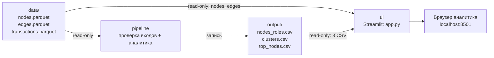

# Архитектура ApexFlow

## Реализуемая схема

`pipeline` и `ui` должны использовать одну Docker runtime-базу. Пайплайн имеет право записывать только в смонтированную папку `output`; интерфейс читает `data` и `output` и не меняет исходные файлы, роли или scores. UI ожидает успешного завершения pipeline, а не просто старта его контейнера.

## Границы модулей

| Компонент | Ответственность | Вход | Выход |
|---|---|---|---|
| Pipeline и аналитика | Проверка Parquet, графовые признаки, роли, кластеры, приоритет | Три исходных Parquet | Три CSV по общему контракту |
| UI | Поиск, отображение роли/объяснения, наблюдаемых рёбер, кластеров и выгрузок | Три CSV + `nodes.parquet` и `edges.parquet` | Локальный экран и неизменённые скачиваемые CSV |
| Браузер | Выбор узла и просмотр результата | UI на `localhost:8501` | Решение остаётся за AML-аналитиком |

Роли, `role_score`, `priority_score` и `cluster_id` рассчитываются только pipeline. Интерфейс использует их как готовые данные; он не пересчитывает и не исправляет их при фильтрации.

## Контейнерные данные

- `./data` монтируется в `/app/data` только для чтения у pipeline и UI.
- `./output` монтируется в `/app/output`: pipeline записывает, UI читает только готовые CSV.
- Ни исходные данные, ни результаты, ни секреты не должны попадать в Docker-образ.
- Визуализация графа в текущем UI — самодостаточный SVG без CDN; стрелки направлены от `src` к `dst`.

Конкретный `Dockerfile`, `compose.yaml`, версии зависимостей и проверенные команды фиксирует разработчик 1. Эту схему нужно сверить с фактической Compose-конфигурацией перед выпуском.
