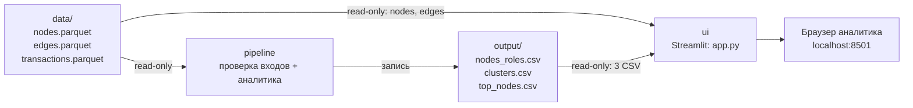

# Архитектура ApexFlow

## Реализуемая схема

`pipeline` и `ui` используют одну Docker runtime-базу Python 3.12 с закреплёнными прямыми зависимостями. Результаты pipeline записываются в смонтированную папку `output`; интерфейс читает `data` и `output` и не меняет исходные файлы, роли или scores. Compose ожидает успешного завершения pipeline, а не просто старта его контейнера. Модуль аналитики ещё требует интеграции: схема описывает целевой полный поток, не пройденную приёмку.

## Границы модулей

| Компонент | Ответственность | Вход | Выход |
|---|---|---|---|
| Pipeline и аналитика | Проверка Parquet, графовые признаки, роли, кластеры, приоритет | Три исходных Parquet | Три CSV по общему контракту |
| UI | Поиск, отображение роли/объяснения, наблюдаемых рёбер, кластеров и выгрузок | Три CSV + `nodes.parquet` и `edges.parquet` | Локальный экран и неизменённые скачиваемые CSV |
| Браузер | Выбор узла и просмотр результата | UI на `localhost:8501` | Решение остаётся за AML-аналитиком |

Роли, `role_score`, `priority_score` и `cluster_id` рассчитываются только pipeline. Интерфейс использует их как готовые данные; он не пересчитывает и не исправляет их при фильтрации.

## Контейнерные данные

- `./data` монтируется в `/app/data` только для чтения у pipeline и UI.
- `./output` монтируется в `/app/output`: pipeline записывает, UI читает только готовые CSV.
- Ни исходные данные, ни результаты, ни секреты не должны попадать в Docker-образ.
- Визуализация графа в текущем UI — самодостаточный SVG без CDN; стрелки направлены от `src` к `dst`.

`Dockerfile`, `compose.yaml` и `requirements*.txt` включены из ветки `main`. Контейнеры работают без root; порт UI опубликован только на `127.0.0.1`. Тестовый профиль не монтирует реальные данные и использует временные синтетические файлы.

Общие проверки схем и межтабличной согласованности находятся в `src/apexflow/io.py`; `ui/data.py` вызывает их, сохраняя исходные CSV-байты для скачивания. Поиск работает по полному набору узлов. Граф ограничивается по числу узлов/рёбер и показывает количество скрытых элементов; это не изменение данных.

Публикация каждого CSV атомарна, публикация трёх файлов целиком — нет. Пересчёт выполняется с остановленным UI, который запускается после успешного pipeline. Проверка сигнатур до/после чтения защищает от изменения файлов в процессе чтения, но не является версионированием набора.

GitHub Pages — отдельная статичная демонстрация. Она использует только `site/demo-data.json`, общий со Streamlit синтетическим режимом; настоящие Parquet и результаты в Pages не копируются. После интеграции и тестирования изменения проходят `личная ветка → staging → main`.
