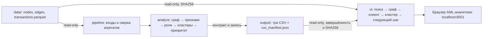

# Архитектура ApexFlow

Pipeline и UI используют общую Docker runtime-базу Python 3.12 с закреплёнными прямыми и транзитивными зависимостями и digest образа; tests — отдельная цель той же базы и Compose-профиль. Образ не содержит данных, результатов или секретов. Runtime работает без root, UI опубликован только на `127.0.0.1` (порт 8501 по умолчанию). Compose ожидает успешного pipeline перед стартом интерфейса.

## Границы модулей

| Компонент | Ответственность |
|---|---|
| `io.py`, `pipeline.py`, CLI | Валидация трёх Parquet, сверка транзакционных агрегатов, вызов аналитики, проверка результата, CSV, manifest, время |
| `features.py`, `rules.py`, `analytics.py` | Полный граф с изолятами, признаки, шесть объяснимых ролей, scores, кластеры, топ; возвращает три DataFrame без записи файлов |
| `ui/data.py` | SHA256 входов и результатов, чтение снимка, общий контракт, точные строковые gid для браузера |
| `app.py`, `ui/graph.py` | Поиск всего набора, фильтры, карточки, SVG, связи и следующие шаги аналитика |
| `ui/demo_examples.py` | Подтверждаемые примеры из текущего расчёта, JSON для репетиции |

Фильтрация и layout не меняют роли, scores или кластеры. Все узлы доступны поиску. Лимиты графа подписаны, полные связи клиента остаются в таблицах. Стрелки сохраняют `src → dst`; встречные рёбра и самопереводы имеют отдельные пути. SVG самодостаточен, без скриптов/CDN, текст из данных экранируется.

## Согласованность расчёта

`data/` подключается только для чтения; `output/` доступен на запись pipeline. До расчёта manifest получает `running`, при ошибке `failed`, после проверки и публикации CSV — `complete`. Он хранит SHA256 трёх Parquet и трёх CSV, версии и отчёт времени; это метаданные запуска, а не четвёртая аналитическая таблица.

Каждый CSV заменяется атомарно; при обрабатываемом сбое публикации уже заменённые файлы восстанавливаются. Групповой атомарности при аварии питания нет. `.pipeline.lock` исключает конкурирующих писателей. Manifest связывает набор: UI отвергает незавершённый/неуспешный запуск, активный lock или несовпадающие хеши. Проверка выполняется до и после чтения; изменение сигнатур прерывает чтение. Перед использованием кэша UI снова проверяет manifest и хеши. Неподвижная страница не опрашивает диск непрерывно, данные проверяются при следующем действии пользователя. Пересчёт — с остановленным UI.

`provenance.py` записывает дополнительные статус/профиль, SHA256 кода, размеры файлов, версии runtime и время этапов. CLI `--verify-output` дополнительно сверяет код образа и согласованный run_id в manifest/status, не меняя CSV. `--acceptance` допускает только полный набор ожидаемого размера и периода. Прежний формат SHA256-словарей manifest сохранён для UI.

Скачивание отдаёт те же полные CSV-байты, по которым построен экран. Период определяется фактическими датами transactions. UI не меняет исходные файлы и результаты аналитики.

## Демонстрация и выпуск

Синтетический Streamlit-режим включается вручную, не требует manifest и не маскирует сбой. GitHub Pages содержит только `site/` с тем же явно синтетическим набором, без реальных Parquet/CSV.

Изменения проходят `личная ветка → staging → main`. Контейнерные тесты проверяют синтетические случаи; сквозной прогон фактических данных и браузер подтверждают интеграцию. Выполненные проверки — в [протоколе](acceptance.md). Репетиция, независимый проход README и отправка на платформе отмечаются только после выполнения.
